<div align="center">

# PCB Defect Detector

**A six-class PCB defect detection showcase trained with RailCompute.**

[](https://railcompute.com/)
[](https://docs.ultralytics.com/)
[](weights/best.pt)
[](weights/best.onnx)
[](requirements.txt)

Detects: `mouse_bite`, `spur`, `missing_hole`, `short`, `open_circuit`, `spurious_copper`

</div>

---

## What This Is

This is a compact open-source-style computer-vision release package for a PCB defect detector.

The model was created as a **RailCompute vibe-training showcase**: a plain-English training request went in, and the automated workflow handled the AI/ML training path from data preparation and cleaning, model-training planning, to training supervision to final model evaluation and packaging with no human in the loop. In this context, "no human in the loop" means there was no manual training-loop engineering/infra-setup/gpu-setup/planning/hand-tuned model iteration between dataset prep, model training, validation/test evaluation, and artefact delivery.

It includes:

- trained weights in PyTorch and ONNX formats,
- a simple one-image inference script,
- RailCompute training notes,
- evaluation metrics,
- training curves,
- confusion matrices,
- dataset disclosure and credits,
- model limitations and safety notes.

This project is primarily a **showcase of automated model training with RailCompute**, not a state-of-the-art PCB inspection benchmark or a production-certified quality-control system.

Metric disclosure:

- The metric values in this README come from `metadata/metrics.json`.
- The training curves are generated from `metadata/results.csv`.
- The model weights are included in `weights/`.
- File hashes are listed in `CHECKSUMS.txt`.
- The narrative text around RailCompute is based on RailCompute's public website and this demo workflow.

## Sample Outputs

Six example before/after outputs from the trained detector. Each sample shows the original PCB crop on the left and the model output on the right with bounding boxes, class labels, confidence, glow, and heatmap-style emphasis.

<table>
  <tr>
    <td width="50%">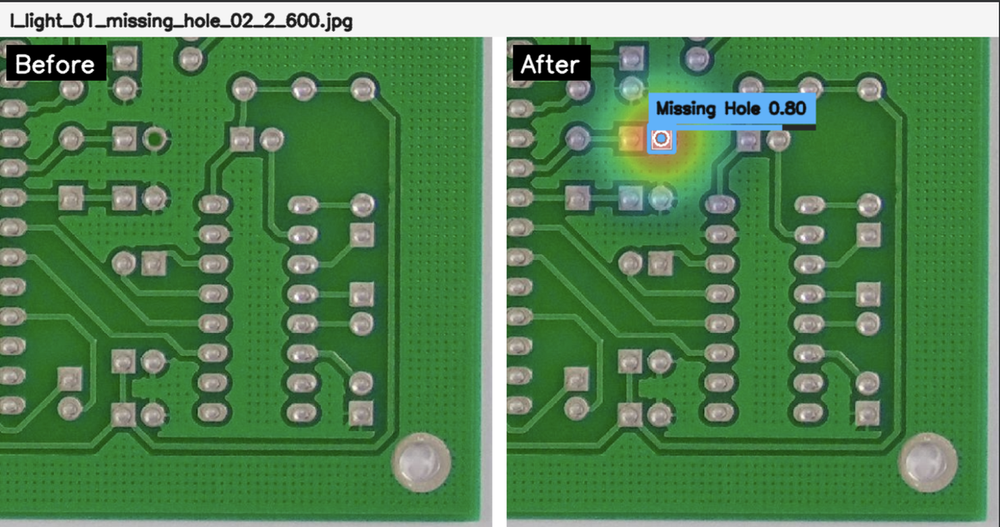</td>
    <td width="50%">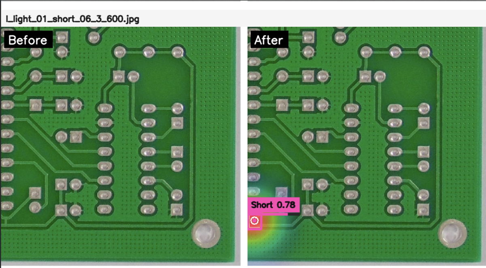</td>
  </tr>
  <tr>
    <td width="50%">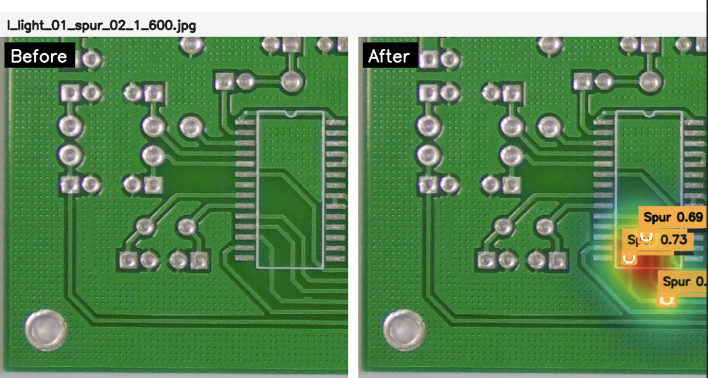</td>
    <td width="50%">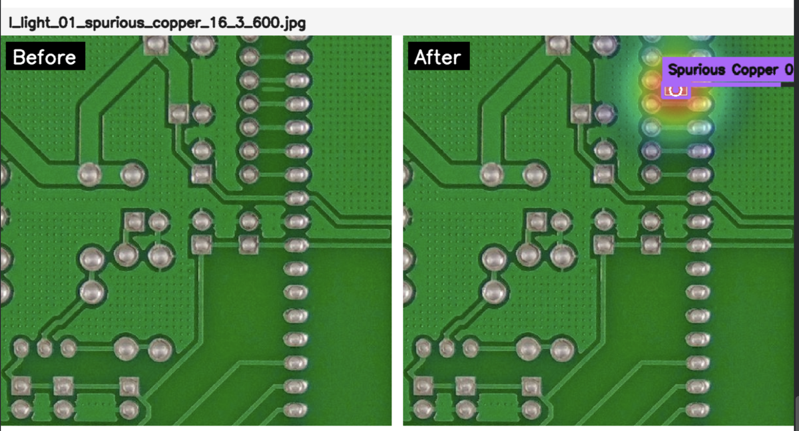</td>
  </tr>
  <tr>
    <td width="50%">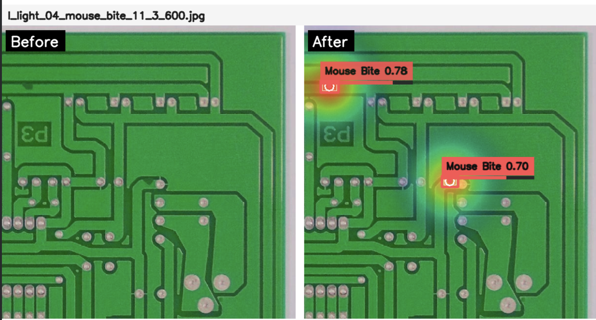</td>
    <td width="50%">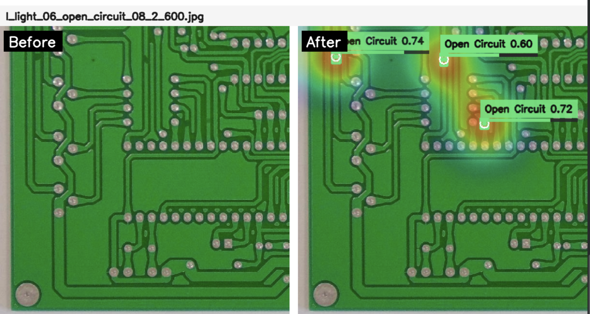</td>
  </tr>
</table>

## About RailCompute

[RailCompute](https://railcompute.com/) is an agentic autonomous platform for fine-tuning AI models for teams and operators. The idea is simple: describe the use case you want to train a  model for with any constraints (if any), approve the plan, and let the training agent handle data preparation, model choice, GPU setup, training, evaluation, packaging, and reporting.

As of this release, RailCompute is still in private beta/build stage. The public website has an early-access waitlist:

**Sign up here:** [railcompute.com](https://railcompute.com/)

This PCB defect detector is an example of what that workflow can look like: a natural-language request was turned into a trained model, evaluation report, weights, inference script, and release package.

---

Watch the full video here on **how we trained a PCB defect detector using RailCompute in plain natural language**: [Watch the video](https://youtu.be/wFrVj07nMIE)

[](https://youtu.be/wFrVj07nMIE)

## Quick Start

```bash
pip install -r requirements.txt
```

Run inference on one image:

```bash
python inference.py \
  --image path/to/pcb_image.jpg \
  --weights weights/best.pt \
  --output examples/output/pcb_image_annotated.png \
  --conf 0.70
```

The script writes one annotated image and prints JSON detections:

```json
{
  "output": "examples/output/pcb_image_annotated.png",
  "detections": [
    {
      "class_id": 2,
      "class_name": "missing_hole",
      "confidence": 0.8123,
      "box_xyxy": [101, 88, 143, 132]
    }
  ]
}
```

Confidence guidance:

- `--conf 0.70`: stricter, cleaner demo/production-style display.
- `--conf 0.50` or `0.60`: better recall during manual review.
- Always tune the threshold on your own production images.

---

## Model Files

The model files are small, so they are included directly in this package.

| File | Purpose | Size |
|---|---|---:|
| `weights/best.pt` | PyTorch/Ultralytics inference | ~5 MB |
| `weights/best.onnx` | ONNX deployment export | ~11 MB |

For larger future checkpoints, use Hugging Face Hub, GitHub Releases, or Git LFS instead of committing large binaries directly to Git.

---

## Results At A Glance

Final test split metrics:

| Metric | Score |
|---|---:|
| Precision | **0.9774** |
| Recall | **0.9896** |
| mAP@50 | **0.9903** |
| mAP@50-95 | **0.5951** |

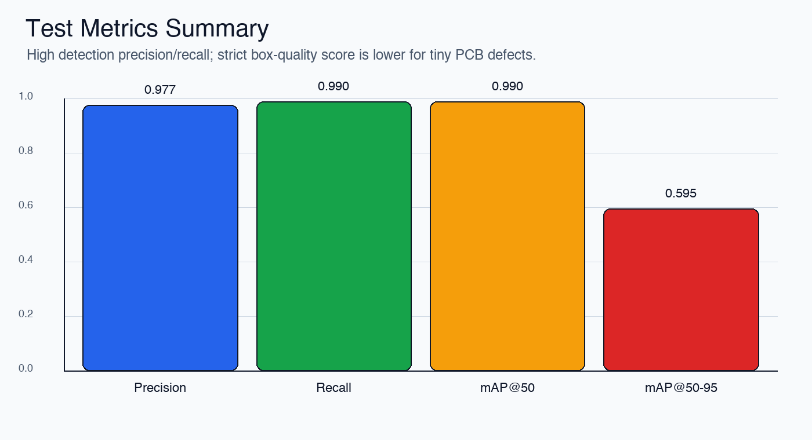

### Per-Class Strict Localization

`mAP@50-95` is a stricter box-quality metric. It is lower than `mAP@50` because PCB defects are tiny, and small bounding-box shifts are penalized heavily.

| Class | mAP@50-95 |
|---|---:|
| `mouse_bite` | 0.5912 |
| `spur` | 0.5829 |
| `missing_hole` | 0.6279 |
| `short` | 0.6176 |
| `open_circuit` | 0.5721 |
| `spurious_copper` | 0.5792 |

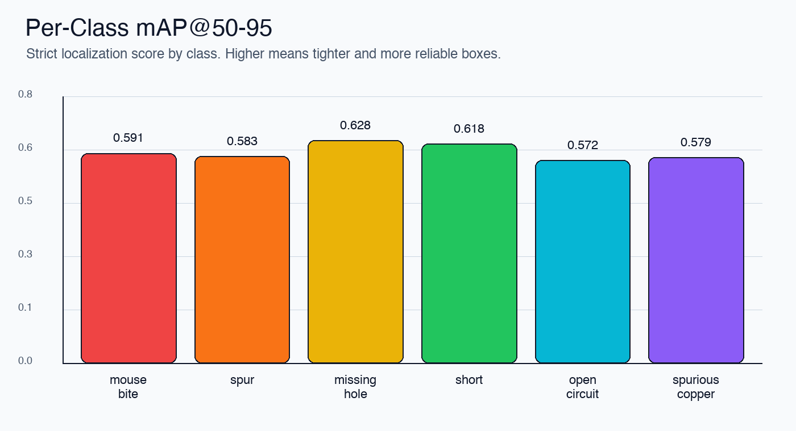

---

## Training Curves

The training run used YOLO11n for 80 epochs at 640px image size.

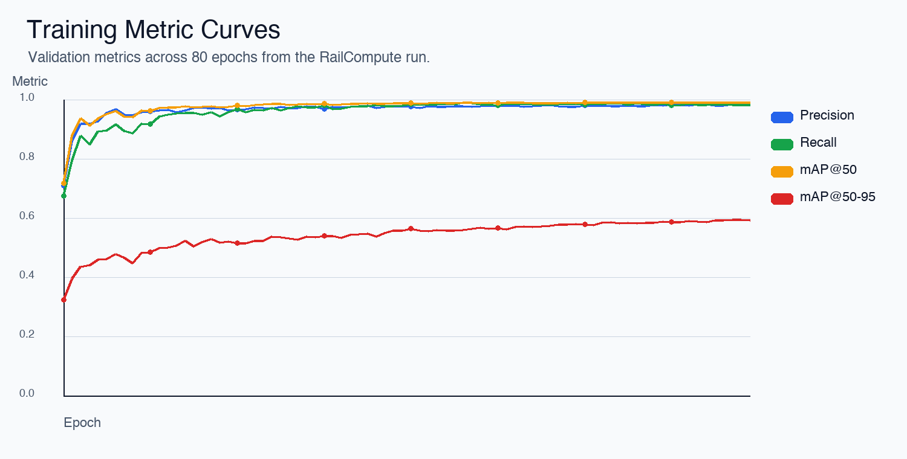

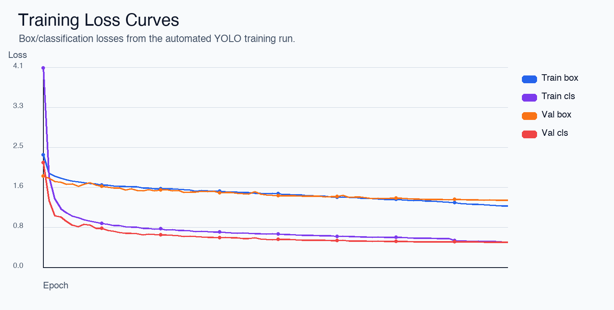

The raw Ultralytics training plot is also included:

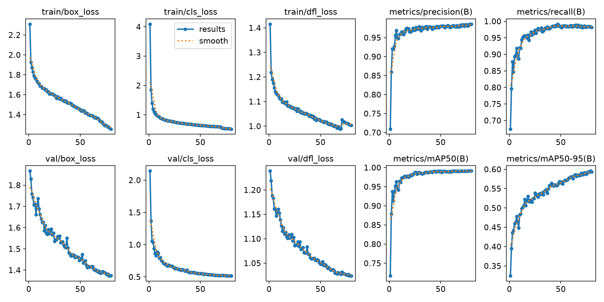

---

## Confusion Matrices

### Test Split

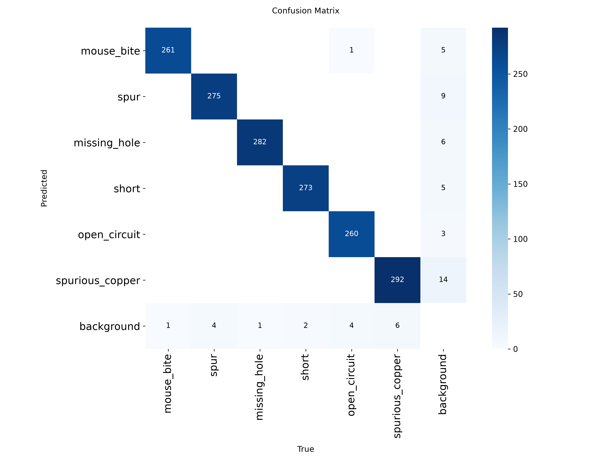

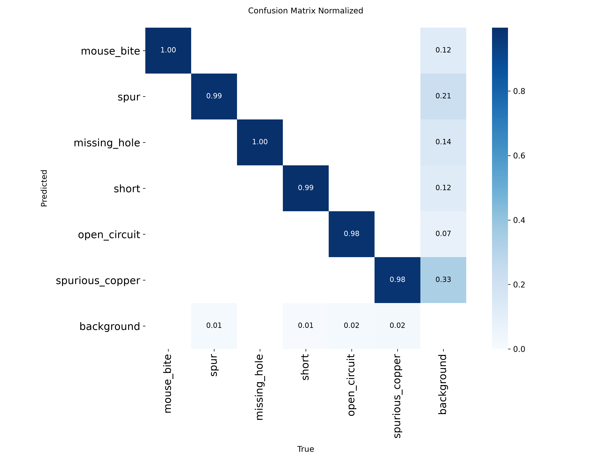

### Validation Split

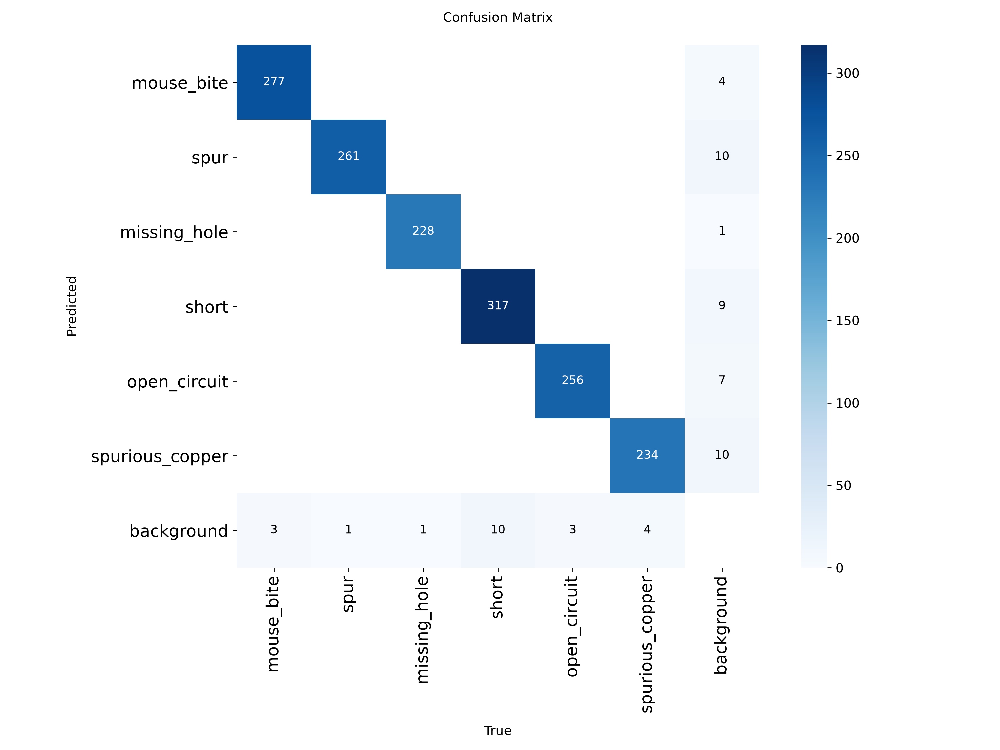


---

## Dataset Disclosure And Credit

Training used the Kaggle dataset:

- **Dataset:** PCB Defect dataset
- **Kaggle uploader:** Norbert Elter
- **Kaggle slug:** `norbertelter/pcb-defect-dataset`
- **Link:** [kaggle.com/datasets/norbertelter/pcb-defect-dataset](https://www.kaggle.com/datasets/norbertelter/pcb-defect-dataset)
- **Format used here:** YOLO object detection annotations
- **Task:** six-class PCB defect detection

The six-class PCB defect taxonomy is associated with the public PCB defect dataset/paper:

- **Paper:** *A PCB Dataset for Defects Detection and Classification*
- **Authors:** Weibo Huang and Peng Wei
- **arXiv:** [arxiv.org/abs/1901.08204](https://arxiv.org/abs/1901.08204)
- **Related public code/data reference:** [Ixiaohuihuihui/Tiny-Defect-Detection-for-PCB](https://github.com/Ixiaohuihuihui/Tiny-Defect-Detection-for-PCB)

See [DATASET.md](DATASET.md) for stricter dataset notes, class mapping, and credit details.

---

## Training Setup

| Item | Value |
|---|---:|
| Training platform | RailCompute |
| GPU used | `rtx_a4000` |
| GPU VRAM | 16 GB |
| Base model | `yolo11n.pt` |
| Epochs | 80 |
| Image size | 640 |
| Batch size | 16 |
| Seed | 42 |
| Exported formats | PyTorch `.pt`, ONNX `.onnx` |

Test-time speed breakdown from the saved evaluation:

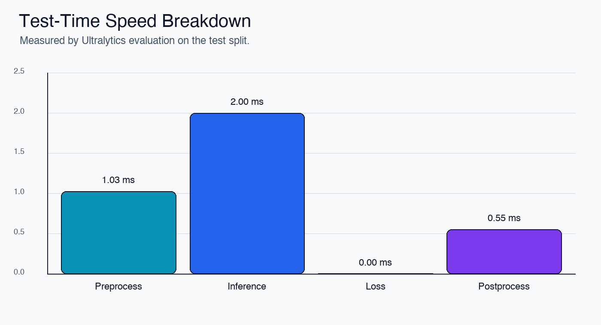

---

## Repository Structure

```text
pcb-defect-detector-railcompute/
  inference.py
  requirements.txt
  README.md
  MODEL_CARD.md
  DATASET.md
  THIRD_PARTY_NOTICES.md
  CHECKSUMS.txt
  weights/
    best.pt
    best.onnx
  assets/
    sample_outputs/
      case_01.png
      ...
    test_metrics_summary.png
    per_class_map50_95.png
    training_metric_curves.png
    training_loss_curves.png
    training_results.png
    test_confusion_matrix.png
    test_confusion_matrix_normalized.png
    val_confusion_matrix.png
    val_confusion_matrix_normalized.png
  metadata/
    metrics.json
    results.csv
    train_config.json
    class_names.json
    data.yaml
  examples/
    input/
    output/
```

---

## Important Limitations

- This is an automated training showcase, not a SOTA benchmark submission.
- It is not production-certified for manufacturing quality-control signoff.
- It was trained for one six-class PCB taxonomy.
- Other PCB datasets may use different labels for visually similar defects.
- Tiny defects can be detected correctly while still receiving lower strict localization scores.
- Validate on your own factory cameras, lighting, PCB types, and defect definitions before use.

---

## Common Open-Source CV Release Checklist

Included here:

- model weights,
- ONNX export,
- inference script,
- model card,
- dataset disclosure,
- training config,
- metrics JSON,
- results CSV,
- training curves,
- confusion matrices,
- third-party notices.

Still recommended before a public GitHub release:

- Choose a license for the code and model weights.
- Add example input/output images if the dataset license allows redistribution.
- Add a Hugging Face model page if you want discoverability outside GitHub.
- Add a citation entry if this becomes a reusable research/demo artifact.

---

## License Status

No final license has been selected in this package yet. Before publishing publicly, choose how you want to license:

- the code,
- the trained weights,
- generated charts and docs,
- any example images.

Do not redistribute dataset images unless the dataset license allows it.
